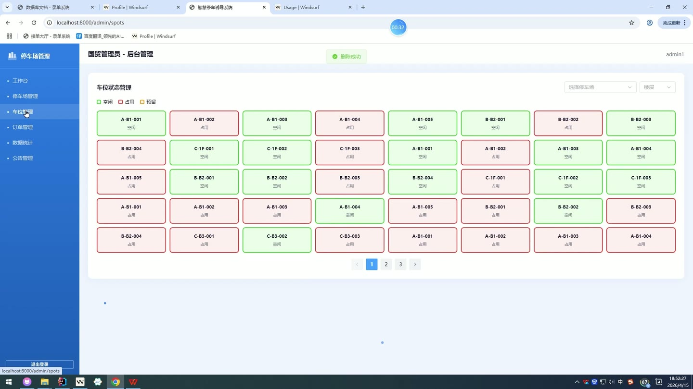
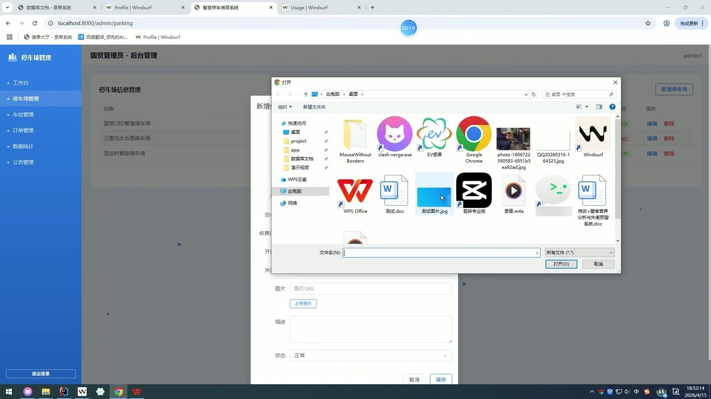
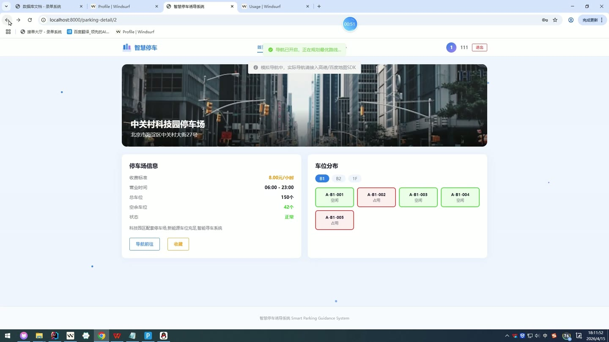

# (附文档)Python+Django+Vue3 智慧停车诱导系统分析及构建

**技术栈**：Python、Django、机器学习、Vue3、MySQL

### 系统简介

智慧停车诱导系统是一套前后端分离的停车场管理与智能推荐平台，后端基于 Django REST Framework 提供接口，前端采用 Vue3 单页应用，数据存储使用 MySQL。系统包含普通用户、停车场管理员、超级管理员三类角色，覆盖停车场信息维护、车位状态管理、停车记录查询、流量与营收分析、AI 停车推荐、公告通知、系统大屏与 AI 调度模拟等完整业务链路。
 
### 核心功能
 
### 普通用户端

 
- 用户注册：填写用户名、密码、手机号、昵称完成注册，默认角色为普通用户。 
- 用户登录：校验用户名与密码，账号被禁用时给出提示并阻止登录。 
- 首页浏览：展示系统品牌信息、实时车位监控、AI 推荐、大数据分析与多角色调度等入口。 
- 停车场搜索：按关键字模糊匹配停车场名称，支持分页浏览。 
- 停车场详情：查看停车场名称、地址、经纬度、总车位、空余车位、每小时收费、开放与关闭时间、图片及描述。 
- 附近停车场：按当前经纬度与半径筛选营业中停车场，使用 Haversine 公式计算距离并按距离升序排列。 
- 停车导航：进入指定停车场的导航页面，需登录后访问。 
- 停车记录查询：按用户维度查看历史停车记录，展示车牌号、停车场名称、入场时间、出场时间、时长、费用与状态。 
- 收藏停车场：对停车场进行收藏、取消收藏，并在收藏列表中查看已收藏停车场详情。 
- 个人资料维护：修改手机号、邮箱、昵称与头像信息。 
- 消息通知：查看个人通知列表，并将指定通知标记为已读。 
- 公告查看：按停车场维度查看已发布公告，包含全局公告与指定停车场公告。
 
### 管理员端

 
- 工作台概览：展示管理停车场数、总车位、空余车位、今日在停等核心指标。 
- 车流量趋势图：以折线图展示近 7 天分时段平均进场与出场车流。 
- 占用率图表：以柱状图展示分时段平均车位占用率。 
- 最新停车记录：展示最近停车记录的车牌号、停车场、入场时间、费用与状态。 
- 停车场管理：新增、编辑、删除停车场，维护名称、地址、经纬度、总车位、空余车位、收费、开放时间、图片、描述与状态。 
- 停车场图片上传：通过上传接口将图片写入媒体目录并回填图片地址。 
- 车位管理：按停车场与楼层筛选车位，以网格形式展示空闲、占用、预留三种状态。 
- 车位状态切换：点击车位在空闲、占用、预留三种状态间循环切换并提交更新。 
- 订单管理：按车牌号与状态筛选停车记录，分页查看入场时间、出场时间、时长与费用。 
- 数据统计报表：按停车场查看总进场、总出场、平均占用率与总营收汇总。 
- 统计图表：展示每日车流量柱状图、每时段占用率折线图与每日营收趋势折线图。 
- 公告管理：发布、编辑、下架公告，支持分页查看标题、内容、发布时间与状态。
 
### 超级管理员端

 
- 超级管理后台：提供工作台、用户管理、停车场审核、诱导规则与数据分析入口。 
- 用户管理：按角色、状态、关键字筛选用户列表，分页查看用户信息。 
- 用户禁用：将指定用户状态置为禁用，或通过状态接口更新用户启用状态。 
- 停车场审核：查看全部停车场列表，按关键字与状态筛选，支持编辑与删除。 
- 诱导规则管理：创建、编辑、删除诱导规则，维护规则名称、类型、优先级、参数与描述。 
- 平台数据分析：查看各停车场使用率、近 7 天每日停车量与营收、用户角色分布。 
- 区域热力图：获取区域热度数据用于可视化展示。 
- 系统图片管理：按类型查询图片列表，创建、编辑、删除系统图片并维护排序与状态。 
- 系统大屏：以可视化大屏形式集中展示停车运营数据。 
- AI 调度模拟：配置用户经纬度与推荐数量，运行调度算法并查看推荐结果与调度日志。
 
### 技术栈

 后端框架Python + Django + Django REST Framework 数据访问Django ORM（模型 managed=False 映射既有数据表） 鉴权与权限基于角色的路由守卫（user / admin / superadmin） 前端框架Vue3 + Vue Router 状态管理Pinia（useUserStore 管理登录用户信息） UI 与图表Element Plus + ECharts 构建工具Vite 数据库MySQL 算法能力机器学习推荐（距离、价格、空位率、用户偏好加权评分）
 
### 交付内容

 
- 后端完整源码 
- 前端完整源码 
- 数据库初始化脚本 
- 万字文档

## 界面展示

---

## 获取完整源码 + 万字文档

本仓库为项目介绍页。**完整前后端源码、数据库初始化脚本、万字项目文档**，请加微信 `kangkangcode`，或访问 [codekk.top](http://codekk.top) 获取。

可作课程设计 / 毕业设计参考，支持远程部署调试。